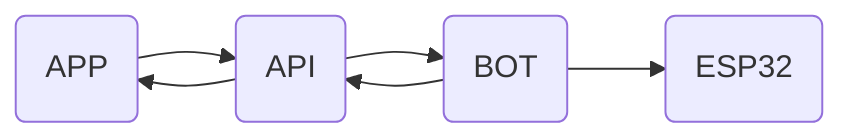
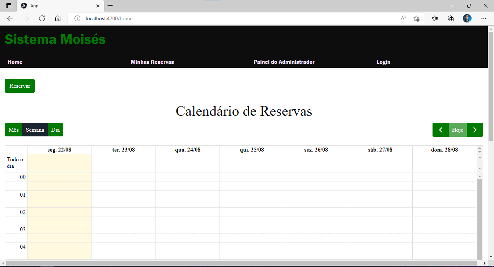

# App Moisés

> Projeto desenvolvido como Trabalho de Conclusão de Curso (TCC) para o curso de Engenharia de Controle e Automação e apresentado em outubro de 2022
> 

# Overview do projeto Moisés

# Objetivo

<aside>

🔎 Aplicação frontend capaz de realizar reservas de espaços compartilhados ( salas de informática, coworking, etc )

</aside>

# Funcionalidades do sistema

- Permissões
    - Somente usuários logados no sistema podem realizar reservas
    - Administradores podem criar novos usuários
    - Todo usuário que acesse o sistema será capaz de visualizar as reservas realizadas — mesmo que não esteja logado
- Reservas
    - É impossível reservar um horário que já esteja reservado. Por exemplo, se uma reserva for realizada para o intervalo de 8h da manhã até às 13h da tarde, só será possível reservar aquele espaço apartir de 13:01h
    - Toda reserva precisa de um título, de uma hora inicial e uma final, bem como de uma senha

# Áreas do Sistema

## Home

<aside>
🚧 O botão “Reservar” só aparece para usuário devidamente logados

</aside>

Calendário das Reservas realizadas

Collapse para realização de reservas

## Reservas

<aside>
✅ Área de controle do usuário sobre suas reservas, permite excluir as reservas, disponibilizando aquele horário para outros usuários

</aside>

## Login

# Implementações Futuras

- Design
    - Criação de um style guide
    - Implementação de transições mais suaves entre as páginas
- Funcionalidades
    - Confirmação em duas etapas para login
    - Aumentar a interatividade dentro do calendário para marcação de horários
    - Marcação de horários em lote